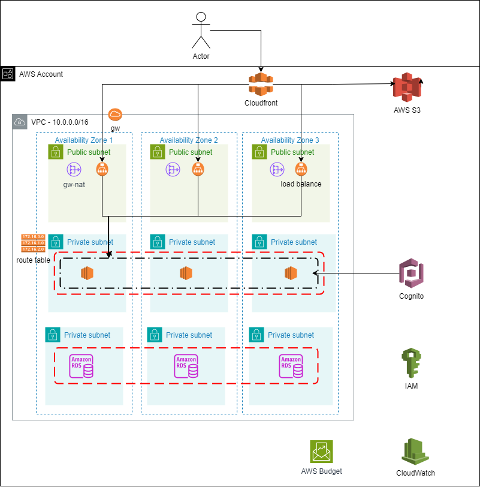

 # Infraestrutura AWS com Terraform


Este repositório contém o código para criar uma infraestrutura na AWS utilizando Terraform para um  **E-commerce de Produtos Digitais**, startup de vendas online de Produtos Digitais. 

O sistema é configurado para **escalar automaticamente** em períodos de alta demanda, como em campanhas de marketing e datas de promoção.

O projeto foi configurado seguindo as práticas recomendadas de arquitetura do AWS **Well-Architected Framework** para projetar e operar sistemas confiáveis, seguros, eficientes, econômicos e sustentáveis na nuvem.

## Arquitetura do Projeto

*Arquitetura do Projeto criada pelo [Draw.io](https://app.diagrams.net/)*

## Diagrama de Fluxo

Abaixo está uma visão simplificada do fluxo de rede e dos recursos envolvidos:

1. O usuário acessa a aplicação por meio do **CloudFront**, que serve de CDN(Rede de Entrega de Conteúdo) e redireciona para o Application Load Balancer e o **bucket S3**.

2. O **Application Load Balancer(ALB)** distribui o tráfego entre as instâncias EC2.

3. As aplicações que estão nas **instâncias EC2** acessam o **Amazon RDS** nas subnets privadas para operações de banco de dados.

4. A infraestrutura está protegida com **Security Groups** e regras de **roteamento** específicas para cada subnet.

## Pré-requisitos
- Terraform: Certifique-se de ter o Terraform instalado. [Instalar Terraform](https://developer.hashicorp.com/terraform/tutorials/aws-get-started/install-cli)
- AWS CLI: Instalando ou atualizando para a versão mais recente do [AWS CLI](https://docs.aws.amazon.com/pt_br/cli/latest/userguide/getting-started-install.html)
- Credenciais da AWS: Configurar o AWS CLI com as suas credenciais para provisionar os recursos.

## Clonando o Projeto

```git clone https://github.com/jncendrette/terraform-aws-ada.git cd terraform-aws-ada```

## Configurando e Executando o Terraform
1- Inicialize o Terraform para baixar os plugins necessários:

```terraform init```

2- Revise e ajuste as variáveis no arquivo **_variables.tf_**, como o bloco CIDR, região da AWS e tipos de instância.

3- Visualize o plano de execução para revisar as alterações que o Terraform irá aplicar:

```terraform plan```

4-Aplique o plano para provisionar a infraestrutura:

```terraform apply```

5- Confirme a execução digitando **_yes_** quando solicitado.

## Limpeza
Para destruir os recursos e evitar custos adicionais, execute:

```terraform destroy```

## Colaboradores

- [Luiz Campedelli](https://github.com/LuizCampedelli/)

- [José Rodrigues Neto](https://github.com/Neto6391)

